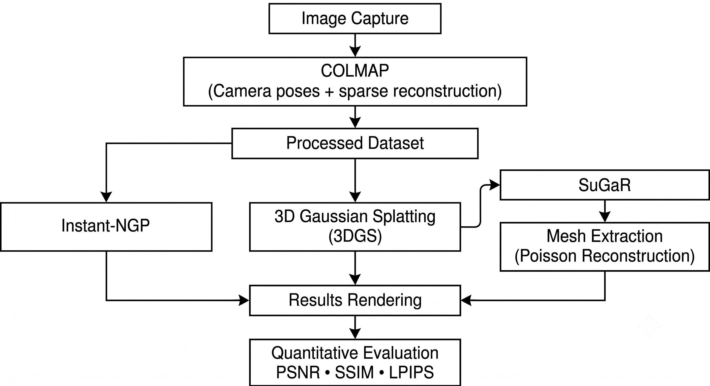

# SuGaR Urban 3D Reconstruction

<p align="center">
  
</p>

An academic reproduction of the SuGaR (Surface-Aligned Gaussian Splatting for Efficient 3D Mesh Reconstruction and High-Quality Mesh Rendering) method proposed at CVPR 2024 using a custom dataset composed of urban monuments and objects.

This project was developed as part of the Computer Graphics course and aims to reproduce the original methodology while replacing the authors' dataset with photographs collected by our team. The reconstructed scenes were quantitatively evaluated using the same metrics adopted in the original paper.

---

## Original Paper

Guédon, A., & Lepetit, V.

**SuGaR: Surface-Aligned Gaussian Splatting for Efficient 3D Mesh Reconstruction and High-Quality Mesh Rendering**

Proceedings of the IEEE/CVF Conference on Computer Vision and Pattern Recognition (CVPR), 2024.

📄 Paper:
https://arxiv.org/abs/2311.12775

💻 Official implementation:
https://github.com/Anttwo/SuGaR

---

This work **is not the original implementation**.
It is an academic reproduction developed using a custom dataset of urban monuments and objects for educational and research purposes.

---

## Project Objectives

- Reproduce the SuGaR pipeline using a custom image dataset.
- Reconstruct real urban monuments in 3D.
- Compare SuGaR with two methods used in the original paper:
  - 3D Gaussian Splatting (3DGS)
  - Instant-NGP
- Evaluate the reconstruction quality using:
  - PSNR
  - SSIM
  - LPIPS

---

## Dataset

The dataset used in this project was created by our team and contains photographs of four urban objects located in São Luís, Maranhão, Brazil:

- Artur Azevedo Bust
- Lion Sculpture
- Cannon
- Historic Light Pole

The original dataset from the paper was **not** used.

---

## Experimental Pipeline

The adopted workflow is summarized below:

1. Image acquisition
2. Camera pose estimation using COLMAP
3. Sparse scene reconstruction
4. Training of 3D Gaussian Splatting
5. Mesh extraction using SuGaR
6. Instant-NGP reconstruction
7. Quantitative evaluation using PSNR, SSIM and LPIPS

---

## Repository Structure

```text
.
├── docs/
├── images/
├── notebooks/ # Google Colab notebooks
├── paper/
├── results/ # Generated meshes and checkpoints
├── LICENSE
└── README.md
```

---

## Folder Description

### notebooks/

Google Colab notebooks used during the experiments.

### images/

Images illustrating the reconstruction pipeline and qualitative results.

### results/

Generated outputs obtained during the experiments, including checkpoints, meshes and point clouds.

### paper/

Portuguese and English versions of the final paper.

### docs/

Additional documentation.

---

## Experimental Environment

The experiments were executed using:

- Google Colab
- NVIDIA A100 GPU
- COLMAP
- SuGaR
- 3D Gaussian Splatting
- Instant-NGP
- Python 3.10

---

## Evaluation Metrics

The reconstruction quality was evaluated using the same metrics adopted by the original paper:

- PSNR (Peak Signal-to-Noise Ratio)
- SSIM (Structural Similarity Index)
- LPIPS (Learned Perceptual Image Patch Similarity)

---

## Results

The qualitative analysis demonstrated that SuGaR successfully reconstructed the evaluated urban monuments while enabling mesh extraction from Gaussian representations.

Quantitative comparisons were performed against 3D Gaussian Splatting and Instant-NGP using PSNR, SSIM and LPIPS.

The experiments confirmed that the reconstruction quality strongly depends on image coverage. Objects with missing upper viewpoints presented incomplete meshes, while the cannon, which had better image coverage, produced the most complete reconstruction.

---

## Citation

If you use this repository, please also cite the original SuGaR paper.

```bibtex
@inproceedings{guedon2024sugar,
  title={SuGaR: Surface-Aligned Gaussian Splatting for Efficient 3D Mesh Reconstruction and High-Quality Mesh Rendering},
  author={Guédon, Antoine and Lepetit, Vincent},
  booktitle={CVPR},
  year={2024}
}
```

---

## Authors

## Authors

This repository was developed by the project team for the Computer Graphics course at the Federal University of Maranhão (UFMA).

## Acknowledgements

We thank the authors of the original SuGaR paper for making their implementation publicly available, enabling this academic reproduction.
